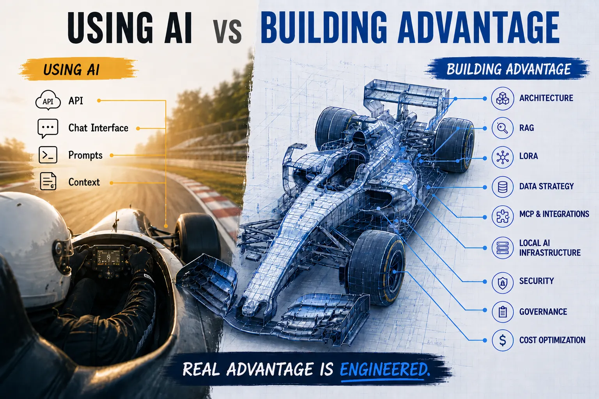
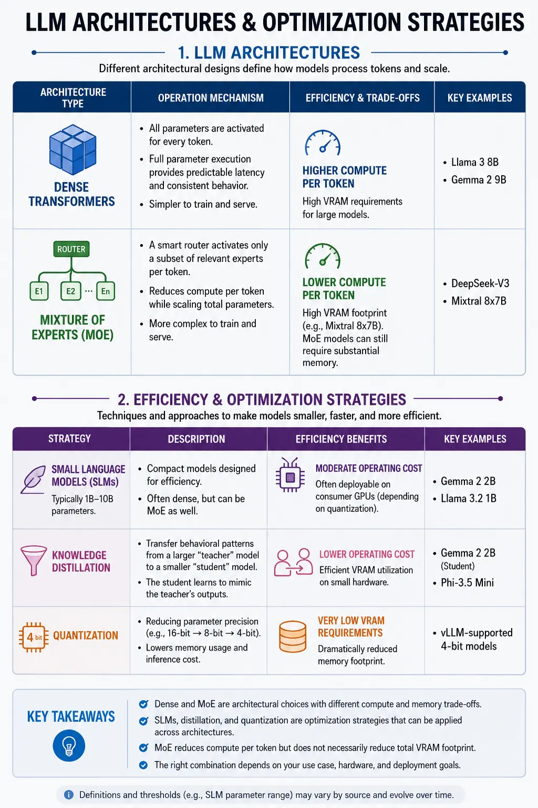
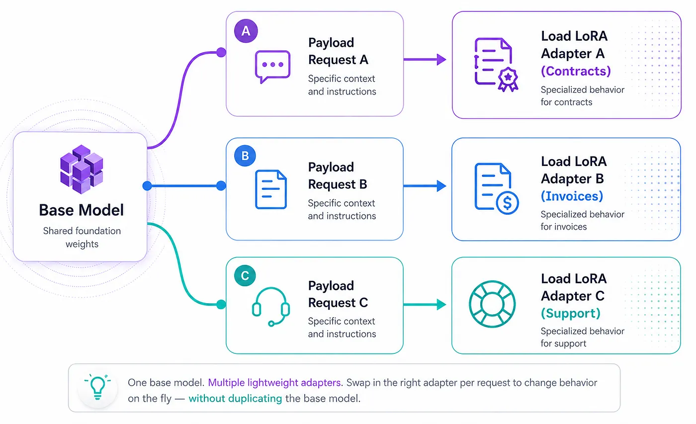
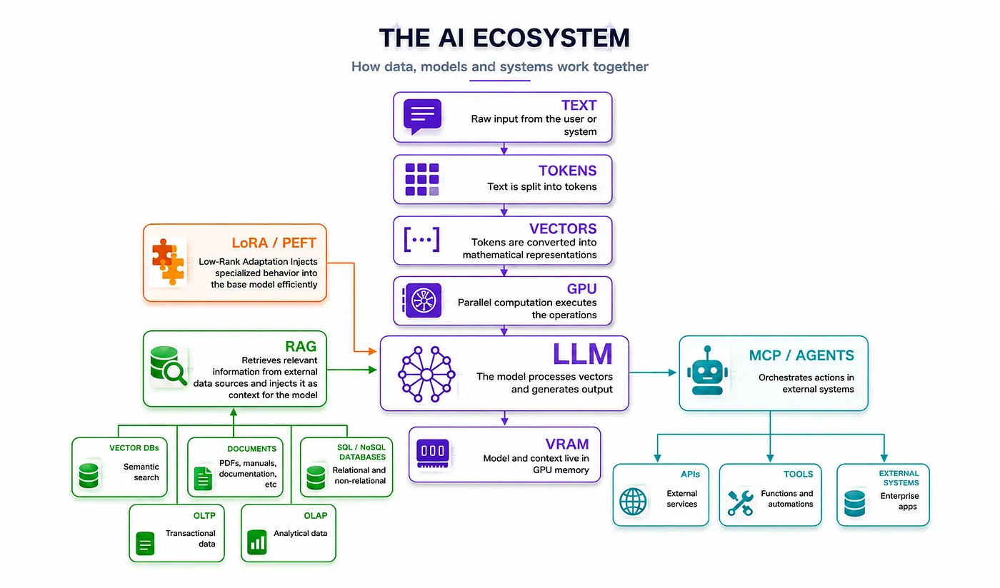

# La IA no eliminó la ingeniería. La volvió más importante.

La mayoría de las empresas hoy cree que implementar IA consiste en elegir un modelo, contratar una API, pasar la tarjeta corporativa y empezar a enviar prompts. Mientras el volumen es chico, suele funcionar. Los problemas empiezan a aparecer cuando se da acceso sin criterio a toda la organización o cuando los portales de desarrollo brindan templates ligados al servicio contratado, sin una estrategia clara por detrás.

Aunque no se entienda del todo lo que pasa tras bambalinas, comercialmente la regla es clara:

**más tokens = más costo**

De ahí nace una cuestión interesante sobre el uso de recursos:

- Cuanto más genérico es el modelo, más largos son los prompts para intentar acotar la respuesta.
- Cuanto menos se entiende el problema, más prompts se realizan.
- Cuanto más particular es el caso de uso o más incertidumbre hay, más contexto se agrega.

Sumado a esto, cuando empezás a armar pipelines de LLMs, agregar agentes o tener múltiples modelos trabajando entre sí, el consumo de tokens se multiplica. De repente, el problema deja de ser “cómo escribir un mejor prompt” o “dar mejor contexto” y pasa a ser otro muchísimo más incómodo: **quizás la estrategia de uso de IA desde el día uno nunca fue la correcta.**

Para entender qué estrategia seguir, hay que conocer el journey operativo de la IA, sus conceptos clave y qué está pasando tanto en la industria corporativa como en las comunidades de desarrollo.

## Desarmando la caja negra: del prompt a la respuesta

Este viaje arranca con el famoso *token*, que no es una palabra, sino la unidad en la que el sistema divide el texto para poder procesarlo. Como las computadoras solo entienden matemáticas, estos tokens se transforman internamente en *vectores*, que son formas algebraicas de representar conceptos, imágenes o fragmentos de código. Todo lo que hace un modelo de IA ocurre operando sobre esos vectores.

Operar millones de vectores simultáneamente es inviable para el diseño secuencial de una CPU tradicional; la IA requiere procesamiento matemático en paralelo, y es ahí donde las GPUs brillan. Se reutilizó el hardware que originalmente nació para los videojuegos. La diferencia es que ahora ya no estamos renderizando polígonos; **estamos renderizando significado.**

Mientras la IA empezó a masificarse, la industria buscó modelos más generalistas, entonces su estructura matemática interna creció. Ahí aparecen los *parámetros*, que son las conexiones internas que transforman los vectores de entrada en vectores de salida. Cuando escuchás hablar de modelos de 7B o 70B, estás viendo la cantidad de miles de millones de conexiones que el sistema necesita para abarcar programación, medicina, leyes e idiomas al mismo tiempo. Toda esa estructura tiene que vivir cargada en la VRAM; a mayor cantidad de usuarios concurrentes y más contexto manejado, más uso de memoria, transformando la inferencia en un problema físico y financiero antes que técnico.

Cuando activar toda la red neuronal para cada token empezó a volverse demasiado costoso y difícil de escalar, la industria reaccionó con arquitecturas como *MoE* (Mixture of Experts). En lugar de activar el bloque monolítico completo, un enrutador inteligente activa únicamente los expertos especializados necesarios para resolver la consulta actual, reduciendo drásticamente el costo operativo de cómputo. A esto se le suman otras estrategias de eficiencia, como el *Speculative Decoding* o la destilación pura.

Mientras las Big Tech competían por construir el modelo más grande, la comunidad Open Source se enfocó en algo mucho más importante: **hacer que la IA dejara de ser absurdamente cara.** La *cuantización* es el ejemplo perfecto: reduce la precisión matemática del modelo para bajar su tamaño. Un modelo que antes requería hardware enterprise pasa a correr en infraestructura mucho más accesible con pérdidas mínimas de calidad.

De esta premisa explotaron *vLLM, llama.cpp, GGUF, AWQ y GPTQ*. Gran parte de las soluciones que hoy hacen viable correr IA fuera de los hyperscalers gigantes nacieron en la comunidad Open Source. **La verdadera democratización en IA nunca fue consumir interfaces empaquetadas; siempre fue entender y abrir el conocimiento y la arquitectura.**

Incluso tras estas optimizaciones, surge una realidad incómoda: en el afán de subirse a la ola, muchas compañías ignoran tres factores operativos fundamentales.

El primero es que muchos problemas de negocio no necesitan modelos gigantes. Una fintech que solo quiere extraer JSONs de contratos regulatorios no necesita un modelo multimodal gigantesco que sepa de filosofía o medicina; necesita precisión, determinismo, bajo costo y latencia estable. La decisión de arquitectura acá consiste en usar un modelo base más chico y específico. De esta forma se limpia la VRAM de capacidades redundantes que no se van a usar, hasta haciendo posible correr estos modelos en infraestructura propia.

El segundo factor es la ineficiencia de intentar controlar el comportamiento o el formato de salida a fuerza de prompts kilométricos. Es un error clásico meter documentos, reglas y ejemplos en cada consulta para forzar al modelo a responder de determinada forma y reducir alucinaciones. Ahí es donde entran *LoRA* (Low-Rank Adaptation) y el *Fine-Tuning* eficiente. En lugar de quemar presupuesto repitiendo instrucciones pesadas en cada prompt y saturando la ventana de contexto, se acoplan adaptadores matemáticos que modifican quirúrgicamente el comportamiento de la red. Ahorrás miles de tokens por request y podés intercambiar estos adaptadores livianos en caliente sobre el mismo modelo base.

El tercer factor es que los modelos, por más buenos que sean, no conocen tu empresa, tu ERP ni tus documentos. Ahí entra RAG (Retrieval-Augmented Generation). El RAG no es magia ni “entrena” al modelo; funciona estrictamente como una capa de alimentación externa que opera como un examen a libro abierto. Busca información relevante en tus sistemas en tiempo real e inyecta esos fragmentos como contexto antes de generar la respuesta. En este caso, el desafío deja de ser el modelo y pasa a ser la estrategia de datos: indexar bien, buscar rápido y evitar meter basura que sature el contexto o destruya la latencia.

El último eslabón es la interacción con sistemas reales. Crear conectores artesanales para cada API resulta rígido y frágil, pero *MCP* (Model Context Protocol) resuelve esto funcionando como un estándar abierto que estructura la conexión con herramientas externas, transformando al LLM de un generador de texto a un orquestador operativo. Sin embargo, esta apertura también introduce un riesgo crítico de gobernanza: levantar servidores MCP sin auditar o permitir que agentes ejecuten herramientas locales sin aislamiento abre la puerta a *prompt injections*, ejecución de código no autorizado y fuga de datos.

## El diseño estratégico: ingeniería, optimización e integración

El mapa mental completo de la arquitectura se puede visualizar de esta manera:

Como conclusión final, queda claro que el problema real nunca son los tokens, los modelos grandes o el uso de RAG y MCP por sí solos; **el problema es la falta de estrategia.** Hay que entender que existen distintos roles que hacen viable una implementación correcta de IA, y que no se trata simplemente de contratar un servicio externo.

Para ponerlo en una analogía:

> No es lo mismo el conductor de un auto, el ingeniero que lo diseña o el mecánico que lo repara. Tampoco cualquier vehículo sirve para cualquier tarea; no podés usar un camión con acoplado para correr en Fórmula 1.

**Entender toda esta cadena de dependencias es lo que te permite construir sistemas sostenibles, eficientes y económicamente viables cuando el negocio empieza a escalar de verdad.**
